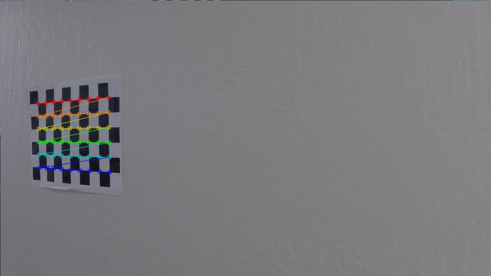
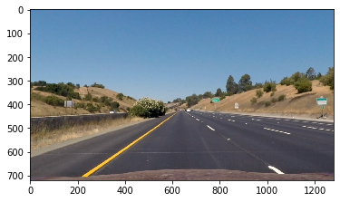
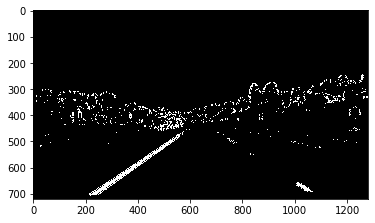
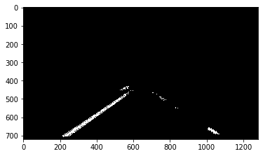
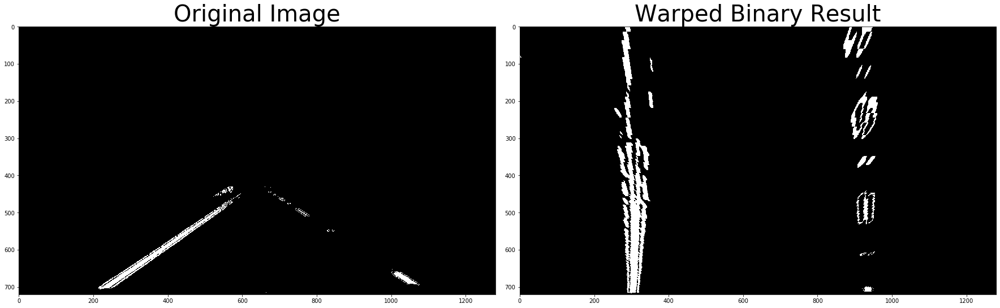
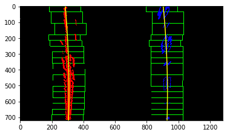
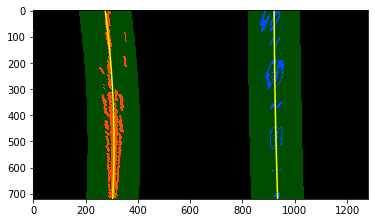
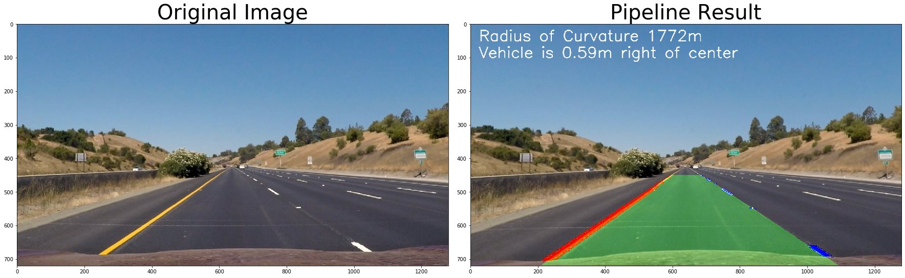

## Advanced Lane Finding

The goals / steps of this project are the following:

* Compute the camera calibration matrix and distortion coefficients given a set of chessboard images.
* Apply a distortion correction to raw images.
* Use color transforms, gradients, etc., to create a thresholded binary image.
* Apply a perspective transform to rectify binary image ("birds-eye view").
* Detect lane pixels and fit to find the lane boundary.
* Determine the curvature of the lane and vehicle position with respect to center.
* Warp the detected lane boundaries back onto the original image.
* Output visual display of the lane boundaries and numerical estimation of lane curvature and vehicle position.

Pipeline Description:
---
In this project, the goal is to write a software pipeline to identify the lane boundaries in a video. The following steps were used to identify the lanes on the road:
* Calculate the camera distortions matrix using the checker board images
* Undistort the car camera images using the distortion/calibration matrix
* Use various color space thresholding and gradients to identify the lane line pixels in the images
* Warp the images to get the bird's eye view image
* Fit a polynomial to the lane pixels
* Project the polynomial back on to the unwarped image with the curvature of the polynomial/road overlayed on top of the image

The pipeline stages are described below with sample output.
The software pipeline I used consisted of the following steps:

1. Camera Distortion Correction
  A checker board of known measurement was used for this purpose. Opencv function findChessboardCorners was used to identify the chessboard corners in the image. The image below shows a sample image with corner points identified.
  
The image points and object points are used to undistort the camera image. A sample raw and undistorted image is shown below:

Raw Image:

 Distortion Corrected Image:

2. Identify lane pixels using a combination of color thresholding and gradient detection.
  HLS, HSV and RGB color spaces were used to color thresholding the lane pixels. Sobel Transform was used after gaussian smoothing to identify vertical lines in the image.

Car Camera Image:

Lane Pixels Image:

3. Region selection:
  A trapezoid ROI was used to filter out the pixels relevant for lane detection.
  
 
  
4. Bird's eye view:
  Opencv function `warpPerspective` was used to get a bird's eye view of the image. A sample image is shown below.
  
  

5. Fit polynomial to the lanes:
  The image is vertically segemented into two, one for left lane and the other for right lane. The two segments are then broken into several sub segments and a histogram of activated pixels in the vertical direction is used to place a selctive window on the lane pixels. The window is slowly slid up vertically and moved to the left or right to center on the activated pixels if the number of activated pixels in the window is greater than a threshold.
  

6. Search around polynomial:
  If the previous polynomial fit is good enough then a search around polynomial function is executed. Here a window is drawn around the initial polynomial fit and a polynomial is fit to the activated pixels around the polynomial.
  

7. Measure the curvature of the lane:
The following formula was used to calculate the curvature of the lane:

The final result along with the undistorted road image is shown below:

The Project
---
The images for camera calibration are stored in the folder called `camera_cal`.  The images in `test_images` are for testing your pipeline on single frames.  If you want to extract more test images from the videos, you can simply use an image writing method like `cv2.imwrite()`, i.e., you can read the video in frame by frame as usual, and for frames you want to save for later you can write to an image file.  

To help the reviewer examine your work, please save examples of the output from each stage of your pipeline in the folder called `output_images`, and include a description in your writeup for the project of what each image shows.    The video called `project_video.mp4` is the video your pipeline should work well on.  

The `challenge_video.mp4` video is an extra (and optional) challenge for you if you want to test your pipeline under somewhat trickier conditions.  The `harder_challenge.mp4` video is another optional challenge and is brutal!

If you're feeling ambitious (again, totally optional though), don't stop there!  We encourage you to go out and take video of your own, calibrate your camera and show us how you would implement this project from scratch!

## How to write a README
A well written README file can enhance your project and portfolio.  Develop your abilities to create professional README files by completing [this free course](https://www.udacity.com/course/writing-readmes--ud777).

