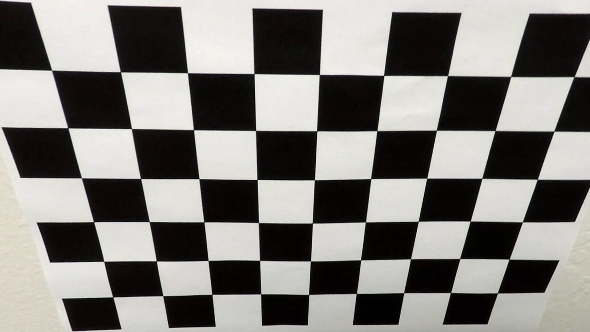

## Advanced Lane Finding

The goals / steps of this project are the following:

* Compute the camera calibration matrix and distortion coefficients given a set of chessboard images.
* Apply a distortion correction to raw images.
* Use color transforms, gradients, etc., to create a thresholded binary image.
* Apply a perspective transform to rectify binary image ("birds-eye view").
* Detect lane pixels and fit to find the lane boundary.
* Determine the curvature of the lane and vehicle position with respect to center.
* Warp the detected lane boundaries back onto the original image.
* Output visual display of the lane boundaries and numerical estimation of lane curvature and vehicle position.

Pipeline Description:
---
In this project, the goal is to write a software pipeline to identify the lane boundaries in a video. The following steps were used to identify the lanes on the road:
* Calculate the camera distortions matrix using the checker board images
* Undistort the car camera images using the distortion/calibration matrix
* Use various color space thresholding and gradients to identify the lane line pixels in the images
* Warp the images to get the bird's eye view image
* Fit a polynomial to the lane pixels
* Project the polynomial back on to the unwarped image with the curvature of the polynomial/road overlayed on top of the image

The pipeline stages are described below with sample output.
The software pipeline I used consisted of the following steps:

### 1. Camera Distortion Correction
  A checker board of known measurement was used for this purpose. Opencv function findChessboardCorners was used to identify the chessboard corners in the image. The image below shows a sample image with corner points identified.
  
The image points and object points are used to undistort the camera image. A sample raw and undistorted image is shown below:

Raw Image:

 Distortion Corrected Image:

### 2. Identify lane pixels using a combination of color thresholding and gradient detection.
  HLS and RGB color spaces were used for color thresholding the lane pixels. Sobel Transform was used after gaussian smoothing to identify vertical lines in the image.

Car Camera Image:

Lane Pixels Image:

### 3. Region selection:
  A trapezoid ROI was used to filter out the pixels relevant for lane detection.
  
 
  
### 4. Bird's eye view:
  Opencv function `warpPerspective` was used to get a bird's eye view of the image. A sample image is shown below.
  
  

### 5. Fit polynomial to the lanes:
  The image is vertically segemented into two, one for left lane and the other for right lane. The two segments are then broken into several sub segments and a histogram of activated pixels in the vertical direction is used to place a selctive window on the lane pixels. The window is slowly slid up vertically and moved to the left or right of center from the previous window, if the number of activated pixels in the window is greater than a threshold.
  

### 6. Search around polynomial:
  If the previous polynomial fit is good enough then a search around polynomial function is executed. Here a window is drawn around the initial polynomial fit and a polynomial is fit to the activated pixels around the polynomial. Here I added extra weightage to the points at the bottom that are more reliable and clearly visible on the camera. This assists the algorithm in finding the correct lines on the road if there are multiple lane lines visible to the camera.
  

### 7. Measure the curvature of the lane:
The following formula was used to calculate the curvature of the lane:

The final result along with the undistorted road image is shown below:

### Pipeline (video)
---
The project final video is stored in `project_video.mp4` in output_images folder. Here's a [link to my video result](./output_images/project_video.mp4)

The challenge videos are also stored in the same location. The outputs for the challenge are problematic due to following reasons:
* The lane marking are faded out
* Dark shadows in bright sunlight trips sobel edge detection algorithm
* Yellow grass triggers color thresholding detection methods
* Road barrier shadows trips sobel edge detection algorithm
* Sharp turns where right lane is completely not visible to the camera

The pipeline can be improved by using following methods:
* Adding a low pass filter to the lane polynomials
* Removing outliers like objects on the road by analyzing the size and aspect ratio of objects
* Filtering algorithm that can check whether left and right lane detections are intersecting and if so reject the one that's less feasible.

